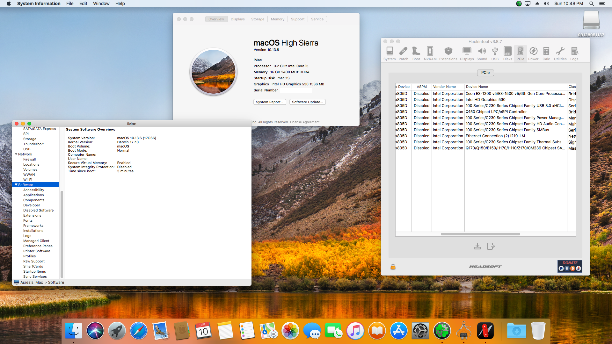

# EFI-HP ProDesk 600 G2 SFF
HP ProDesk 600 G2 Small Form Factor EFI Folder Hackintosh

:information_source: **The current version is fully macOS compatible based on this PC hardware.**
Clover, drivers, and kexts are always up to date!

:information_source: The EFI's have been tested on HighSierra.

 
    
## :computer: Hardware:

| **Category** | **Component**                         |
| ------------ | ------------------------------------- |
| **CPU**      | 3.2GHz Intel Core i5-6500             |
| **GPU**      | Intel HD 530                          |
| **RAM**      | 16GB                                  |
| **SSD**      | 256GB SATA SSD + 500GB HDD            |
| **Display**  | 30' LG TV Display (DP to HDMI)        |
| **Wi-Fi/BT** | Intel Dual Band Wireless-AC 3165      |
| ------------ | ------------------------------------- |

## :white_check_mark: Working:

- [x] CPU power management.
- [x] Graphics acceleration.
- [x] USB ports.
- [x] HDMI video & audio output.
- [x] Ethernet.
- [x] Audio (Internal speakers, 3.5mm headphone jack).
- [x] Internal microphone.
- [x] iCloud & App Store.

## Images:

:information_source: Hackintosh Setup On High Sierra

## Credits:

[**Apple**](http://apple.com/)

[**Milad Tahanian**](https://github.com/mtahanian)